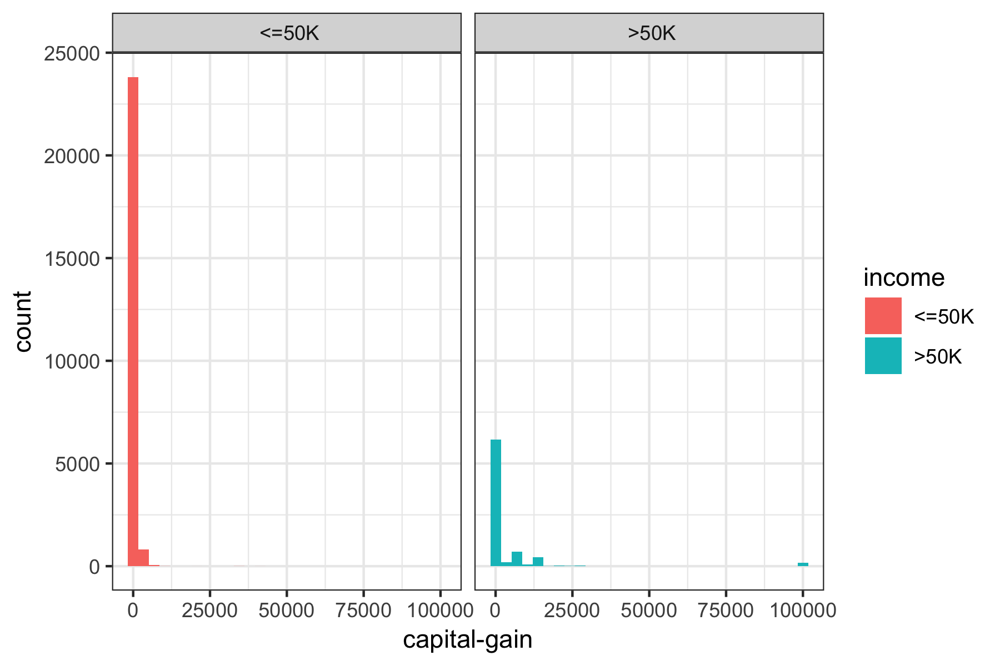
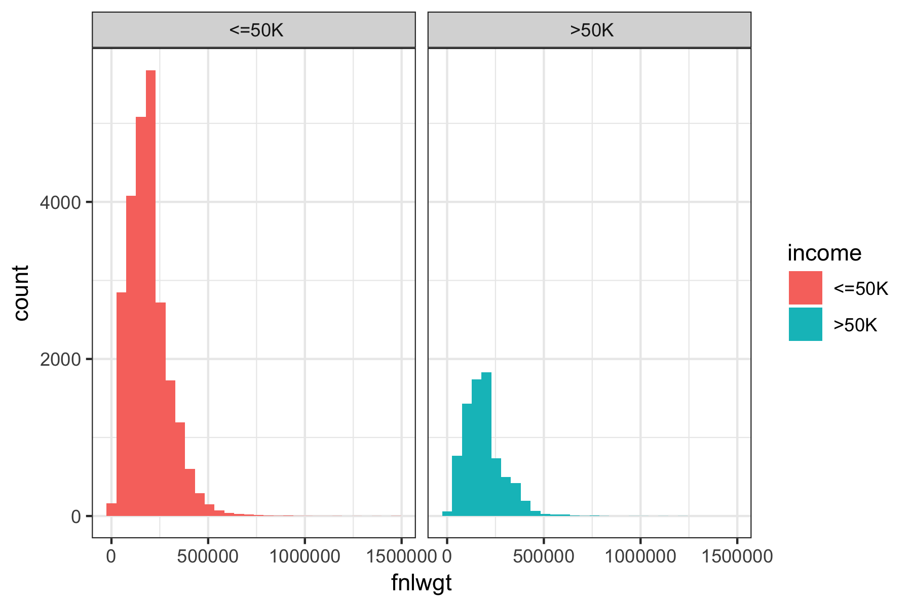

### **I. Introduction:**

[bs]

### **II. Data:** 

### **III. Data Processing/Feature Engineering:** 
#### **Data Cleaning and Exploratory Analysis:**


At first glance, we look for a relationship between income and other continous variables: 

```{r, echo = FALSE, fig.align='center', fig.width = 5, fig.show='hold', out.width='.49\\linewidth'}



```

* Capital loss: people with income over 50K tend to have higher capital loss overall, but with smaller maximum capital loss. 
* Capital gain: people with income over 50K tend to have higher capital gains, with some extreme outliers with values over 100k. We may need to remove them during the cleaning process.
* Age: the age distribution of people whose income less than 50K tends to skewed to the left, indicating that they are of a younger age. Meanwhile, the age distribution of people with income higher than 50K is roughly normal, with higher mean and median. 
* Education number: people with higher income tend to have higher education-numbers
*  fnlwgt: both income groups roughly share the same distribution for the final weight

We also look at the distribution of each continous variables and see if any relationship in the dataset. There isn't any highly correlated pair of variables so there is no need to remove any variable at this stage. 

```{r, echo = FALSE, fig.align='center', fig.width = 5, fig.show='hold', out.width='.49\\linewidth'}
knitr::include_graphics('./Image/Prepocessing/corr_plot.png')

```


#### Feature Engineering: 

[bs] Since some categorical variables have more than 10 levels, this will affect the performance of tree based method for deciding splitting nodes, we reduce the number of levels by grouping based on our observation. We also refer to the income report for 1994 from census bureau. 
https://www.census.gov/prod/2/pop/p60/p60-193.pdf

New features are generated from the following variables: education, martial status, race, sex, and relationship. 

1. Education: 

We first combine educations levels into the following categories:

+ Less than high school
+ High school with no degree
+ High school diploma or equivalent
+ Some college, no degree
+ Associate’s degree
+ Bachelor’s degree
+ Master’s degree
+ Doctoral degree and professional degree

```{r, echo = FALSE, fig.align='center', fig.width = 5, fig.show='hold', out.width='.49\\linewidth'}
knitr::include_graphics('./Image/Prepocessing/degreevsinc.png')
```

We observe that the income does seem to change with the degree, thus we decide to use the median income for each degree level that we found in the income report instead of the original education level. This new column is named `Edu_Mean_Inc`. We also removed education-num because it has the same information as the education level. 

2. Age: 

We decide to break age into 7 bins of ranges, to improve classification: 

- 15- 24 years
- 25- 34 years
- 35 - 44 years
- 45 - 54 years
- 55 - 64 years
- 65 -74 years
- 75 years and older

We also replace each age category with median income from the income report. 

3. Race: 

We first combined "Amer-Indian-Eskimo" with "Other" since the ratio is small. 
We observed that less females of minorities class earn more than 50K than white female. We decided to make a new column based on gender and minority status. For example, if individual is female and is black, this person will in class "fb". We also replace the actual catergory with median income that associate with the specified gender and race. The new column is `gen_race`.

Race variable is replaced with median income that associated with race in the new variable `Race_Med_Inc`. 

4. Marital_status

+ For marital status, we split the groups into based on whether or not that person was married, considered to legally have a spouse, and whether or not their spouse was living with them. "Has-Spouse" indicates that the person was married and with their spouse (Married-civ-spouse for civilian spouses, and Married-AF-spouse for spouses from the armed forces), whereas "Married-spouse-absent" and "Separated" denoted an "Absent-Spouse". Divorced and Widowed were placed under the same category as "No-Spouse", while Never-married stayed the same but was renamed "Single". 

+ We observed income level is affected by both gender and martial status. Thus we create a new column that combine both information of gender and martial status, then replace each category with the median income. For example, person who is has spouse absent and is female will have median income $\$23,400$ while male has spouse absent has income $\$29401$. This column is name `Gen_Med_Mrg_Inc`.

5. Occupation: 

+ Splitting up Occupation was largely based on three levels - white vs blue collar, service vs not service, and then skilled vs. not skilled for not service jobs.

+ Similar to what we did with gender and martial status, we also combine information of occupation and gender into a new variable `occ_sex` and replace the level with median income. 

+ Because our new columns contain information about gender, we decided to remove `gender` column. 

6. Workclass:

The workclass variable currently has 8 different levels - Federal-gov, Local-goc, State-gov, Private, Self-emp-inc, Self-emp-not-inc, Without pay, and Never-worked. We decided to group all the government jobs together, after examining the income ratio for each. We did not combine the self employed classes together, given that self employed incorporated positions tend to have higher pay than not-incorporated ones. Finally, We combined those that never worked with those that were without pay into a new group, of those who were not working. 

7. Relationships:

For relationships, this is the relationship of the surveyor to a central household figure. Unmarried referred to an unmarried partner; as such, we combined that we "Not-in-family" to make a grouping of Not-relative relationships. Husband and Wife were grouped together under "Spouse", while the last two remaining classes were combined as "Other-relative" relationships.

8. Capital_gain
We noticed that there appear to be outliers for capital gain (there was a chunk of data that had values of over 99999). As such, we decided to change these outlier values to the mean value of the capital gains.


### IV. Model builing 

Because of imbalanced class situation, instead of randomly sample data to divide into train and test set, we used stratified sampling to make sure that the ratio between 2 classes are the  same in each dataset. We use 80% of data for the train set and 20% for the validation set. 

We original build a simple model on four datasets, the dataset with missing value removed with feature engineering and with original features, and the dataset with missing values imputed by `misForest` with feature engineering and with original features. This simple model includes a decision tree, bagges trees with 100 tress, and random forest with 100 trees without any hyperparameter tunning. The baseline models are defined as the models on the original dataset without any feature engineering and with missing values removed. The models' performance using random forest is reported below: 

```{r, echo = F}
models = c("Baseline", "Removed Missing Values with Feature Eng.", "Imputed Missing Values w/t Feature Eng.", "Imputed Missing Values w Feature Eng.")
accuracy = c("81.7%", "82.8%", "82.7%", "86%")
tpr = c("95.4%","93.5%","94.6%","75.9%")
fpr = c("18.8%", "19.2%","18.3%","11.3%")
spec = c("99.5%","99.2%", "99.4%","93.7")
tab = data.frame(rbind(accuracy, tpr, fpr, spec))
colnames(tab) = models
tab
```


The base

#### A. Decision Tree: 

#### B. Bagged Trees: 

#### c. Random Forest

#### 