### I. Introduction: 

This report focuses on the classification process for adult census data from 1994. We are looking to predict whether or not a person's salary is greater or less than 50K, based off of other attributes. The purpose of this project is to construct and analyze various models generated by classification trees.

For this report, we examine and clean the various features of our original data, and then selected the features that appeared to have the most influence on income prediction. We addressed the presence of class imbalance through different sampling techniques, and also tuned parameters with cross-validation before finalizing our models.

After performing feature engineering, we model three different classification trees and analyze the results. We find that our most successful tree that we built was our final RandomForest model, which ultimately had AUC value of 0.9137.

### II. Data: 

The data used for this project came from the UCI repository, donated by Ronny Kohavi and Barry Becker.  The basis of this data originated from the 1994 Census database. Multivariate data was collected onadult individuals, and was divided into a training set of 32561 observations and a test set of 16281 observations. There are 15 variables total, 6 of which are numerical and the other 9 variables are categorical. 

Although most of our integer attributes were continuous, we noticed that education-num appeared to operate like a categorical variable, and had 16 levels. Our categorical attributes, with their relative number of levels, are: workclass(6), education(16), marital-status(7), occupation (14), relationship (6), race(5), sex(2), and native-country(41). 

Income was also factored into two levels: <= 50K, and > 50K. 23.93% of the data had income >50K. After observations with missing values were removed, this probability became 24.78%. 

At first glance, the original dataset was immense; creating an interpretable classification tree from this would need thoughtful data preparation. As such, we focused heavily on properly analyzing the data and examining each variable.

### III. Data Processing/Feature Engineering: 

#### Data Cleaning/ Explonatory Analysis: 

We first look for a relationship between income and other continous variables: 

```{r, echo = FALSE, fig.align='center', fig.width = 5, fig.show='hold', out.width='.49\\linewidth'}
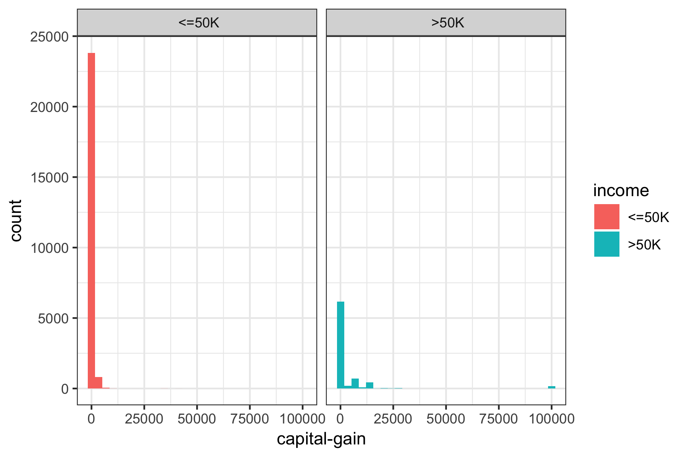
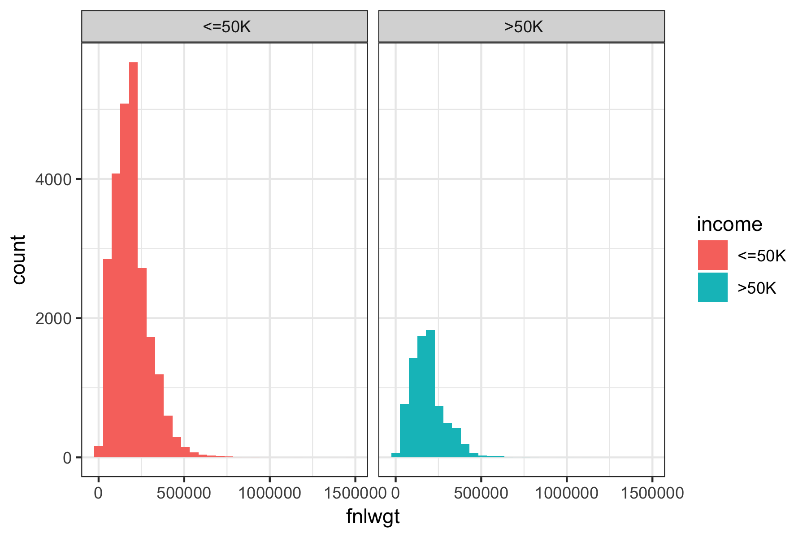

```
* Capital loss: people with income over 50K tend to have higher capital loss overall, but with smaller maximum capital loss. 
* Capital gain: people with income over 50K tend to have higher capital gains, with some extreme outliers with values over 100k. We may need to remove them during the cleaning process.
* Age: the age distribution of people whose income less than 50K tends to skewed to the left, indicating that they are of a younger age. Meanwhile, the age distribution of people with income higher than 50K is roughly normal, with higher mean and median. 
* Education number: people with higher income tend to have higher education-numbers
* fnlwgt: both income groups roughly share the same distribution for the final weight

We also look at the distribution of each continous variables and see if any relationship in the dataset. There isn't any highly correlated pair of variables so there is no need to remove any variable at this stage. 

```{r, echo = FALSE, fig.align='center', fig.width = 5, fig.show='hold', out.width='.49\\linewidth'}
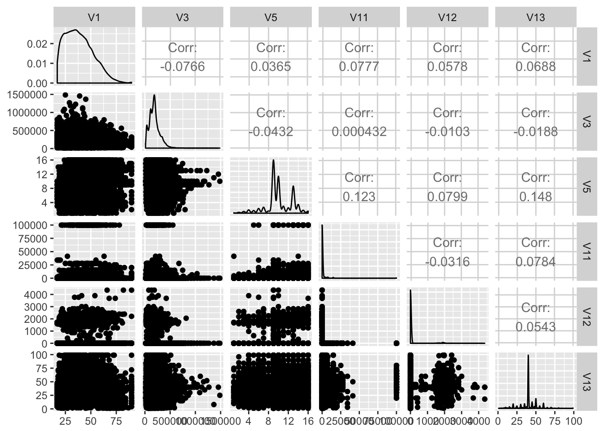

```

*Missing values:* 

There is a total of 4262 missing values, for 2399 observations. Missing values are seen in the original dataset as '?' symbols. All the missing values belonged to three columns: occupation, nativecountry, and workclass, and multiple missing values were frequent for the same observation. As thus, it is likely that the missing values are not at random (MNAR). 

```{r, echo = F}
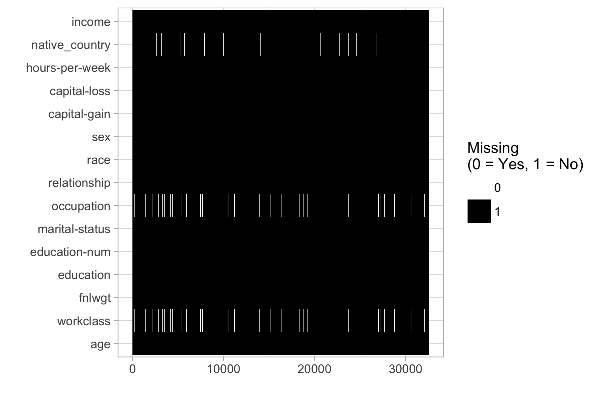
```


Given the MNAR circumstances, we wanted to proceed carefully. We were not sure if a dataset with the missing values removed would display better results than a dataset with imputed values for our classification models. Thus, we decided to proceed with our feature engineering on two separate datasets (one with imputations, one with removed observations) and determine at the end which one performed better for classification. 


#### Feature Engineering: 

Since some categorical variables have more than 10 levels, this will affect the performance of tree based method for deciding splitting nodes. We aimed to reduce the number of levels by grouping, based on our observations. Throughout our feature engineering, we referred to information drawn from the the income report for 1994 from US government census bureau (can be accessed online at  https://www.census.gov/prod/2/pop/p60/p60-193.pdf)

Ultimately, we generated new features from the following variables: education, martial status, race, sex, and relationship. Features not described below were not altered during our engineering process.

1. Education: 

Our first step is to combine educations levels into the following groupings:

+ Less than high school
+ High school with no degree
+ High school diploma or equivalent
+ Some college, no degree
+ Associate’s degree
+ Bachelor’s degree
+ Master’s degree
+ Doctoral degree and professional degree

```{r, echo = FALSE, fig.align='center', fig.width = 5, fig.show='hold', out.width='.49\\linewidth'}
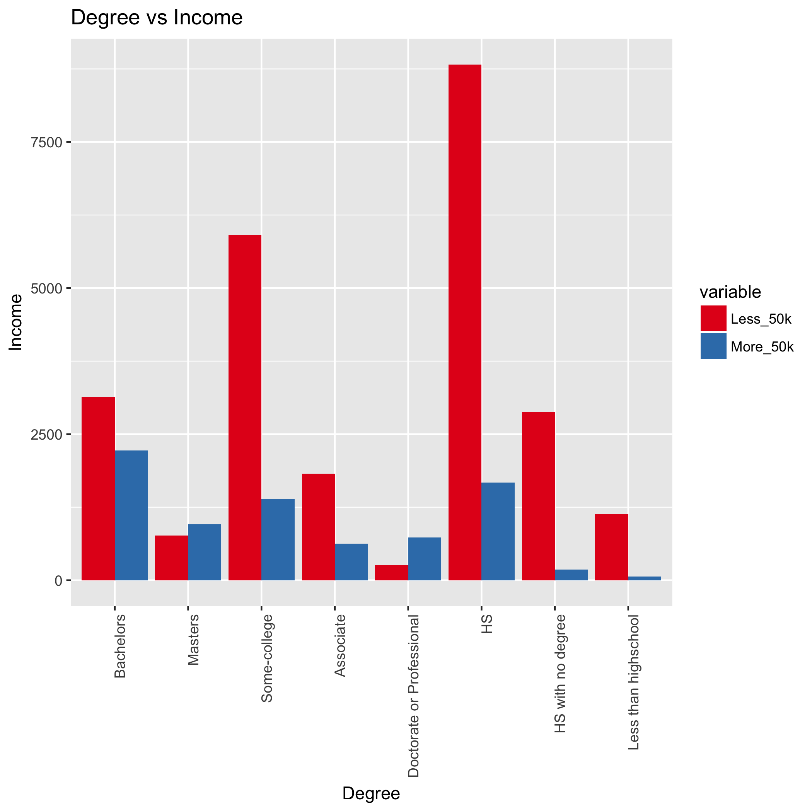
```

We observe that income does seem to change with the varying degrees. Thus, we decided to use the median income for each degree level that we found in the census income report, instead of the original education level. We believed that having numerical values instead of leaving the variable as factors could affect the model precision. We renamed this variable into `Edu_Mean_Inc`, thus removing the 'Education' variable. We also removed education-num because it essentially has the same information as the education level and so was not necessary. 

2. Age: 

We decide to break age into 7 bins of ranges, to improve classification: 

- 15 - 24 years
- 25 - 34 years
- 35 - 44 years
- 45 - 54 years
- 55 - 64 years
- 65 -7 4 years
- 75 years and older

Like with education, we decide to replace each age group with the median income for that group, based on the data from the 1994 income report. 

3. Race: 

We first combined "Amer-Indian-Eskimo" with "Other", since they both were a small proportion of the observations and they had similar ratios of income (>50K over <=50K).

We then observe that less females of minority classes earn more than 50K than white female. We decide to make a new column based on gender and minority status. For example, if individual is female and is black, this person will in class "fb". We then replace these categories with the 1994 median income that associated with the specified gender and race. The new column is `gen_race`.

Race categories were also replaced with their associated median income, in the new variable `Race_Med_Inc`. The former Race category was removed.

4. Marital_status

For marital status, we split the groups based on whether or not that person was married, considered to legally have a spouse, and whether or not their spouse was (presumably consistently) living with them. These combinations also were chosen because they tended to have similar income distributions. "Has-Spouse" indicates that the person was married and with their spouse (Married-civ-spouse for civilian spouses, and Married-AF-spouse for spouses from the armed forces), whereas "Married-spouse-absent" and "Separated" denoted an "Absent-Spouse". Divorced and Widowed were placed under the same category as "No-Spouse", while Never-married stayed the same but was renamed "Single". 

We also observe that income level is affected by both gender and martial status. Thus we create a new column that combine both information of gender and martial status (of the original variable), then replace each category with the median income. For example, a married person who has an absent spouse and is female will have median income $\$23,400$, while the male counterpart has a median income $\$29401$. This column is named `Gen_Med_Mrg_Inc`.

5. Occupation: 

Splitting up occupation was largely based on three levels - white vs blue collar, service vs not service, and then skilled vs. not skilled for not service jobs. These combinations again tended to have fairly similar rations between the number who earned over 50K and those who earned equal/less than that.

Similar to what we did with gender and martial status, we also combine information of occupation and gender into a new variable `occ_sex`, where we replace the level with the respective 1994 median income for each group. 

Because our several of our new variables contain information about gender, we decide to remove the `gender` column to reduce unnecessary overlap. 

6. Workclass:

The workclass variable currently has 8 different levels - Federal-gov, Local-goc, State-gov, Private, Self-emp-inc, Self-emp-not-inc, Without pay, and Never-worked. We decided to group all the government jobs together, after examining the income ratio for each. We did not combine the self employed classes together, given that self employed incorporated positions tend to have higher pay than not-incorporated ones. Finally, we combined those that never worked with those that were without pay into a new group, of those who were not working. 

7. Relationships:

This variable should refer to the relationship of the surveyor with that of a central household figure. Unmarried refers to an unmarried partner; as such, we combined that we "Not-in-family" to make a grouping of Not-relative relationships. Husband and Wife were grouped together under "Spouse", while the last two remaining classes were combined as "Other-relative" relationships. Again, the income ratios made these groupings reasonable.

8. Capital_gain:

We noticed that there appear to be outliers for capital gain (there was a chunk of data that had values of over 99999). As such, we decided to change these outlier values to the mean value of the capital gains.


### IV. Model Building:

Because of imbalanced class situation, instead of randomly sampling data to divide into our train and test set for model-building, we used stratified sampling to ensure that the ratio between the 2 income classes is the same for each dataset. We use 80% of data for the train set and 20% for the validation set. 

We originally build a simple model on four datasets, the dataset with missing value removed with feature engineering and with original features, and the dataset with missing values imputed by `misForest` with feature engineering and with original features. This simple model includes a decision tree, bagged trees with 100 tress, and randomforest with 100 trees, all without any hyperparameter tuning. The baseline models are defined as the models on the original dataset without any feature engineering and with missing values removed. The models' performance using random forest is reported below: 

```{r,echo=FALSE}
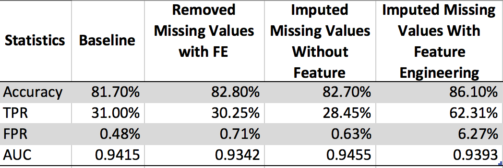
```

Since the imputed data set with feature engineering have significantly higher true positive rates and accuracy, we decide to choose the imputed missing values with feature engineering as our final dataset to build our models. Our other datasets (imputed without feature engineering, removed with feature engineering, and removed without feature engineering) are not utilized in the remainder of our analysis.

Except for decision trees, we fit models using independent categories (fit model using formula `income~., data`) and grouped categories (fit model using format `xtrain, ytrain`). With independent categories, the model makes a dummify matrix for each categories variable, so the feature importance score isn't very expressive. Meanwhile, running models with group categories shows to increase model complexity. However, with our sampling methods described below, some models can't be computed because of the dimension limits. Overall, we see that the models wih independent categories perform worse than grouped categories ones, so we decided to use the `xtrain`, `ytrain` format over the formula format, to fit most of our models.  

We noticed that even with our best model, it still does not do a good job with predicting people with income more than 50k. This is caused by the imbalanced class problem. Thus, we try different sampling techniques for bagged trees and random forest models. We build three types of models: 

##### 1. Sampling methods with accuracy metric: 

The problem with imbalanced classes is that the event rate of minority class is significantly less than that of the majority class. One natural way to fix this issue is by sampling each class to balance the event rates. We employ four different sampling methods: 

+ Up sampling: sample with replacement from the minority class until each class has the approximately the same number.
+ Down sampling:select data points from the majority class so that the majority class is roughly the same size as the minority class. 
+ Down sampling with bootstrap sampling: create a bootstrap sample roughly a same size from each class. The choice of sample here is 50.
+ SMOTE sampling: use both up-sampling and down sampling. While down-sampling in smote is the same as described aboe, to up-sampling the minority class, SMOTE synthesizes new cases by sampling from the minority class and its KNN. 

The models are built using accuracy as the metric; in other words, the model fits the parameter to maximize accuracy. 


##### 2. Sampling methods with AUC metric:

We then use the same sampling methods that were described in the previous section, but decide to maximize AUC instead of the accuracy metric to build our models. By using AUC metrics, we hope to improve the performance for minority class instead of only targeting the majority class. 

##### 3. Class weights and sampling methods with AUC metric:

Besides our sampling methods and using the AUC metric, we also utilize unequal case weights to penalize the majority class. The class weights we implement for class i is computed as: $\frac{1}{#classes * #observation for class i}$

#### A. Decision Tree 

For our decision tree, we utilized functions from the tree and rpart library to fit our classification tree. In our baseline model based solely on the validation set, we found that only four variables (relationship, capital-gain, Edu_Mean_inc, and occupation) were used in the construction. There were 8 terminal nodes, and the misclassification rate was 15.8%.

To better fit this tree, we ran cross-validation to tune the tree complexity. With 10 folds, we found that the lowest cv error rate was 4120 cv errors, elbowing at 5 nodes. Deviation appeared to increase fairly linearly with k.

```{r, echo=FALSE, fig.align='center'}
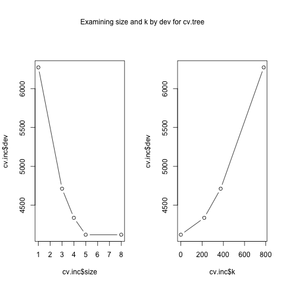
```

As such, we fit our classification tree by this size 5, and found that our model to be the same as the baseline. Pruning by different levels of k did not significantly improve our accuracy rate, so we did not change that parameter.

To confirm these results, we also pruned through the rpart library, using the cp values. We found the cp of the smallest tree, that was within 1 standard deviation of the tree with the smallest xerror. Our best xerror was 0.65678 with xstd of 0.0093883, so we selected the smallest tree with an error less than 0.6661683 This is the 4th tree, with cp = 0.010.  Our test error is 0.006166048.

```{r, echo=FALSE, fig.align='center'}
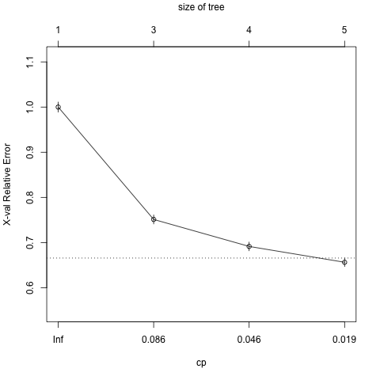
```

From this process, we again found that the resulting decision tree was equivalent to our baseline. For our selected decision tree, the classification accuracy rate is 84.57%. The 5 most significant variables and their statistics are as below:

Features              | Scores (not scaled)
----------------------|----------------
relationship          | 1861.25609
Gen_Med_Mrg_Inc       | 1831.20301
marital_status        | 1831.20301
Edu_Mean_inc          | 753.37400
capital_gain          | 762.63259
      
The graph shows the variable importance as a proportion for each feature.
```{r, echo=FALSE, fig.align='center'}
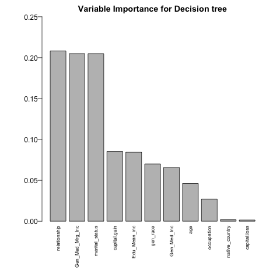
```

Our selected decision tree model had an AUC value of 0.8503 when we ran an ROC curve against our validation set. 
```{r, echo=FALSE, fig.align='center'}
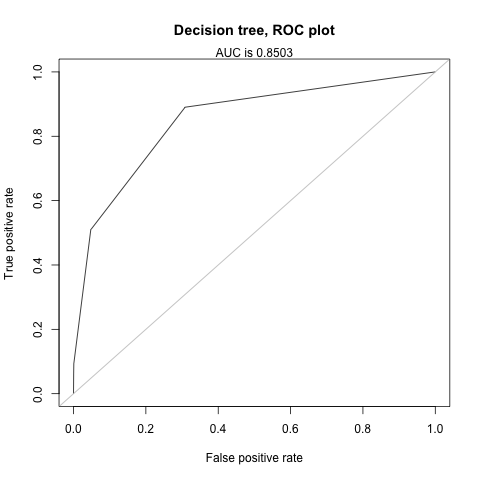
```


#### B. Bagged Trees 

For bagging decision trees, the tuning parameter we examined is the number of trees to include. We did this by increasing the number of trees by 50 until we saw accuracy stopped showing improvement, and saw that accuracy leveled out at 200 trees. We also considered tuning to the depth of the tree  (examining node size or the maximum number of nodes), but did not find a consistent parameter to utilize. We utilized a 5-fold cross-validation, with grid search.

We then decided to account for class imbalance through different sampling procedures to see which one was the best; these sampling methods were described above, and utilized . The model that we saw with the highest AUC value was the down sampling methods with the ROC measure, with a training accuracy rate of 82.75%, TPR of 0.8316, specificity of 0.8263, and a FPR of 17.3746%. The other models and their various statistics when modeled against the test validation set are shown in the table below.

```{r, echo =FALSE}
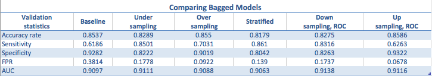
```

The top 7 most important features for this model, and their corresponding values are as follow:

Features              | Scores (scaled)
----------------------|----------------
relationship          | 100.000
fnlwgt                | 76.5515
capital-gain          | 31.8887
Edu_Mean_inc          | 27.7286
hours-per-week        | 27.3747
occupation            | 25.0592
age                   | 19.3836


```{r, echo=FALSE}
knitr::include_graphics('../Image/Model_Building/Bagged_varImp_down_fit')
```
      
For our final bagged tree model, we utilized only the top 10 most important variables from the previous model. This was mostly because we saw that running a model using all of the features only increased accuracy and our other rates by a few percentage points. 

Our final model's ROC curve on the validation set had an AUC value 0.911.
```{r, echo=FALSE}
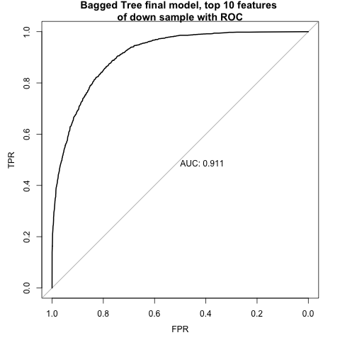
```

#### C. Random Forest

We fit a random forest with 10 from `caret` package using three sampling techniques as described previously. Random search and grid search with 5-fold cross validation are implemented to tune hyperparameter simultaneously while training the model to find which model that perform the best. Our two tuning parameters are `mtries` and `ntree`. 

We observe that the TPR increases significantly from 10-20% when compared to the baseline models. Accuracy and AUC also increases with new models. Out of 12 models, the model using bootstrap stratified down sampling does not perform that well compared to other models. 

Since each model performs differently in each income class, we look at the feature importance scores for the model that perform well for the majority class (Less than 50k) and the model that perform well for the minority class (> 50K). 


```{r, echo =FALSE}
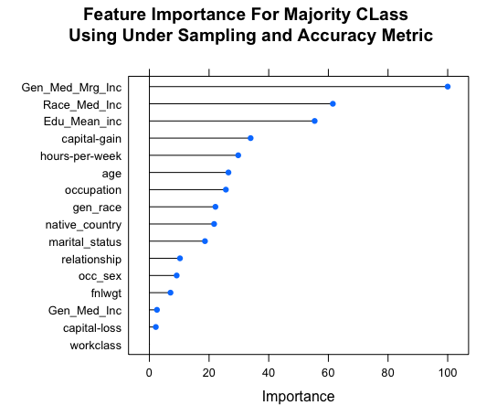
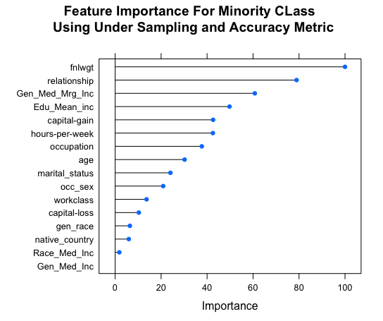

```

The plots indicate that while `fnlwgt`, `relationship` don't contribute well in model for majority class, it is the most importance feature to predict for minority class. The most common featues for both classes are: `Gen_Med_Mrg_Inc`, `Edu_Mean_Inc`, `captial_gain`, `hours_per_week`, `age`.

To select the best model, we examined 4 statistics: accuracy, TPR, FPR, and AUC. Our best random forest model is the model using the down sampling method with unequal class weights and under the ROC metric. From this model, we look at variable importance to select the top 10 features, and retrain the model with top ten features to predict the test set. The parameters for this model were `ntree = 100`, `mtry = 3`. Below is the importance score for the top 5 features and the statistics of chosen models: 


Features           | Scores (scaled)
-------------------|----------------
fnlwgt             | 100.000
Gen_Med_Mrg_Inc    | 93.975
relationship       | 92.981
Edu_Mean_inc       | 83.541
occupation         | 69.536


Statistics   |  Rate
-------------|---------
Accuracy     |  89.63%
TPR          |  94.52%
FPR          |  11.91%
TNR          |  88.09%
AUC          |  97.71%


```{r, echo= FALSE}
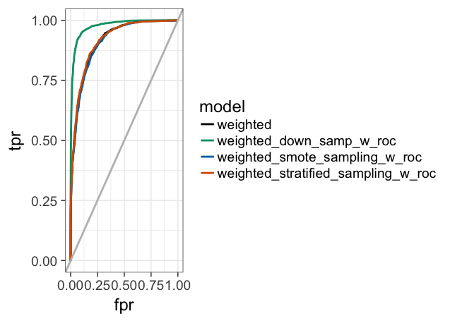
```


#### V. Results and Conclusion:

When we ran our final decision tree model against the test dataset, we found that our ROC curve had a AUC value of 0.845. Our sensitivity (0.5057), specificity (0.9493), and FPR (0.0507) all remained fairly similar to what they were when we tested this model in our training validation set. 

```{r, echo=FALSE}
knitr::include_graphics('../Image/performance/TEST_Decision_ROC.png')
```

We found that our final bagged tree model had higher success in classification of income than our decision tree. The AUC against the test set was 0.897, which was slightly lower than our AUC for the validation set (0.911). Similarly, we saw that our sensitivity(0.8190), specificity(0.8051), and false positive rates (0.1949) all decreased slightly from what they were for the validation set. The model correctly classified 80.84% of the predictions.

```{r, echo=FALSE}
knitr::include_graphics('../Image/performance/TEST_Bagged_ROC.png')
```

Our final random forest models perform better than the decision and bagged trees. 
Our confusion matrix for this model is reported at: 


Prediction| Less.50k  | More.50k
----------|-----------|----------
Less.50k  |   10032   |  636
More.50k  |   2403    |  3210

Our accuracy rate is at 81.3% with TPR of 83.46% and AUC of 0.9137.

```{r, echo=FALSE}
knitr::include_graphics('../Image/performance/rf_final_roc.png')
```

For our analysis, the random forest model was the most successful and versitale classifer. Initially we had some concerns that we were overfitting our model, but our overall performance on the test set is still fairly similar to what we achieved during validation. However, across all three models our performance statistics were not drastically different, ranging well within 10% differences. We feel that the strength of all three models attests to the success of our feature engineering efforts, which we extensively worked on. Across all three models, we saw fairly similar variables featured in importance, including variables that we had generated or altered during our feature engineering, like with education mean income. Our final result is a randomforest model that achieves an AUC of 0.9137, with fairly strong specificity and sensitivity. Proper data analysis and processing in combination with an understanding of tuning parameters and sampling techniques, can really benefit a classification model, as so long as measures to prevent overfitting are established as well.
